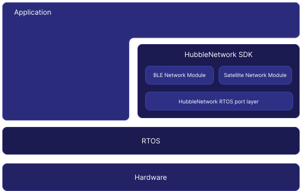

.. _hubble_architecture:

Architecture
############

The SDK architecture is built on modularity and extensibility, accommodating
a broad range of implementation requirements. The diagram below illustrates the
role of the Hubble Network SDK within an embedded application:

   Hubble Network SDK Architecture

The following sections summarize its primary components.

Service Modules
***************

The Services Layer contains the core functionality of the SDK, including the
satellite and BLE network modules. Applications interface with the SDK
through these components, leveraging a high-level API that streamlines satellite
and BLE communication.

Satellite Module
================

.. warning::

   The satellite module is currently in **pre-production** and is not yet ready
   for production deployments.

Provides APIs to transmit data to the Hubble Network. Because satellite
communication relies on Hubble Network, this module assumes ownership of the
target radio and possibly other devices when in use.

BLE Network Module
==================

Offers APIs to generate Bluetooth® advertisement packets, enabling connections
to the Hubble Bluetooth Low Energy (BLE) Network. This module uses the standard Bluetooth protocol
and does not assume ownership of any hardware. The application is responsible
for managing the Bluetooth stack.

.. note::
   Hubble Network Inc. is a Bluetooth Member Company.

   - Member Service UUID: `0xFCA6
     <https://bitbucket.org/bluetooth-SIG/public/src/d6855ad309bd25b87e72ab84b7ee5084b662cb3b/assigned_numbers/uuids/member_uuids.yaml#lines-1219>`_

Port Layer
**********

The Port Layer acts as an abstraction between the Service Modules and
RTOS-specific implementations. It defines an API that simplifies porting the
SDK to various RTOS environments beyond those natively supported.

The :ref:`project_organization` page describes how these layers map onto the
source tree, the naming conventions used throughout, and where new code should
go.

.. toctree::
   :maxdepth: 1

   project-organization
